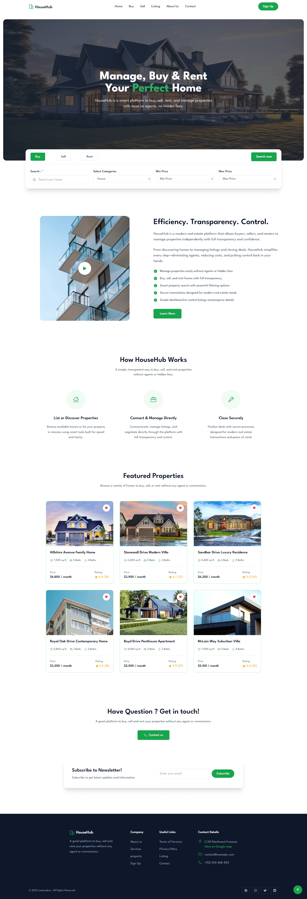

  <h1>HouseHub - Property Platform</h1>

  

    <strong>About Project:</strong> 
    A responsive property management platform for buying, selling, and renting homes without agents or commissions. Built with modular JavaScript components, Tailwind CSS utility classes, and smooth animations organized in clean ES6 modules that property platforms can customize with search filters, property cards, newsletter subscription, mobile navigation, and much more.
  

  
 
    <strong>What I learned:</strong>
    Created reusable component architecture with ES6 modules and template literals, implemented mobile-first responsive design with Tailwind utility classes, built interactive tab system and search functionality with vanilla JavaScript, and much more.
  

  
 
    <strong>Personal Note:</strong>
    I started building HTML, CSS, and JavaScript projects in 2022.  
    At that time, I focused on learning first and began uploading to GitHub recently.  
    Now I'm working with <strong>React.js</strong> and <strong>Next.js</strong>, and seeking opportunities as a <strong>frontend</strong> or <strong>web developer</strong>.
  

 
  
<h2>Project More Details</h2>

  
 
    
<h4>What's Inside</h4>

    <ul>
      <li><strong>Header Component</strong> - Fixed navigation with logo, menu links, sign-up button, and mobile hamburger menu</li>
      <li><strong>Hero Section</strong> - Full-width banner with background image, overlay, headline with highlighted text, and property search card</li>
      <li><strong>Search Card</strong> - Property search form with tabs for Buy/Sell/Rent, category dropdown, price range filters, and search button</li>
      <li><strong>About Section</strong> - Two-column layout with image, video play button with pulse animation, description text, and feature list</li>
      <li><strong>Services Section</strong> - Three cards explaining platform features with icons, titles, and descriptions</li>
      <li><strong>Featured Properties</strong> - Grid of property cards showing images, details, pricing, ratings, and favorite buttons</li>
      <li><strong>Contact Section</strong> - Call-to-action with contact button and newsletter subscription form</li>
      <li><strong>Footer Component</strong> - Brand information, navigation links, contact details, and social media icons</li>
      <li><strong>Back to Top Button</strong> - Floating button that appears on scroll for quick page navigation</li>
      <li><strong>Mobile Menu</strong> - Full overlay navigation with smooth height transition and icon toggle</li>
    </ul>
  

  
 
    
<h4>Technologies Used</h4>

    <ul>
      <li><strong>HTML5</strong> - Semantic structure with proper meta tags and accessibility attributes</li>
      <li><strong>Tailwind CSS (CDN)</strong> - Utility-first styling with custom configuration for League Spartan font</li>
      <li><strong>JavaScript (ES6+)</strong> - Modular components using imports, template literals, and DOM manipulation</li>
      <li><strong>Google Fonts</strong> - League Spartan font family for modern typography</li>
      <li><strong>Ionicons</strong> - SVG icons for UI elements, property details, and social media</li>
      <li><strong>CSS Animations</strong> - Smooth transitions, hover effects, pulse animations, and scroll-triggered visibility</li>
      <li><strong>Responsive Design</strong> - Mobile-first approach with Tailwind breakpoints (sm, md, lg, xl)</li>
      <li><strong>ES6 Modules</strong> - Component-based architecture with separate files for header, hero, about, services, properties, contact, footer, and back-to-top</li>
    </ul>
  

  
 
    
<h4>Project Structure</h4>

    <pre>
    house-hub/
    │
    ├── index.html                 # Main HTML with component mount points
    │
    ├── assets/
    │   ├── js/
    │   │   ├── app.js            # Main entry point importing all components
    │   │   ├── header.js         # Header component with mobile menu
    │   │   ├── hero.js           # Hero section with search card
    │   │   ├── about.js          # About section with video button
    │   │   ├── service.js        # Services cards component
    │   │   ├── property.js       # Property listings grid
    │   │   ├── contact.js        # Contact and newsletter section
    │   │   ├── footer.js         # Footer component
    │   │   └── backTop.js        # Back to top button
    │   │
    │   └── images/               # Hero background, property photos, about image
    │
    └── README.md                 # Project documentation
    </pre>
  

  
 
    
<h4>Key Features</h4>

    <ul>
      <li><strong>Fully Responsive Design</strong> - Works seamlessly across all devices from 320px mobile to desktop screens</li>
      <li><strong>Modular Component Architecture</strong> - Each section built as independent ES6 module for easy maintenance</li>
      <li><strong>Mobile Navigation</strong> - Hamburger menu with smooth height animation and icon toggle</li>
      <li><strong>Interactive Search Tabs</strong> - Buy/Sell/Rent tabs with active state styling and smooth transitions</li>
      <li><strong>Property Search Form</strong> - Text input, category selector, and price range filters for property discovery</li>
      <li><strong>Property Cards Grid</strong> - Responsive grid layout with images, details, pricing, ratings, and favorite buttons</li>
      <li><strong>Video Play Button</strong> - Animated pulse effect on about section video placeholder</li>
      <li><strong>Newsletter Subscription</strong> - Email input form with inline submit button in rounded container</li>
      <li><strong>Scroll-Triggered Button</strong> - Back to top button appears after scrolling 300px with fade-in animation</li>
      <li><strong>Hover Effects</strong> - Color transitions on buttons, links, and property cards</li>
      <li><strong>Template Literal Rendering</strong> - Components use data objects and template strings for content generation</li>
      <li><strong>Cross-Browser Compatible</strong> - Tested on modern browsers with Tailwind CSS compatibility</li>
    </ul>
  

  
 
    
<h4>Quick Start</h4>

    <ol>
      <li>
        <strong>Clone the repository:</strong>
        <pre><code>git clone https://github.com/nawazdevx/house-hub.git</code></pre>
      </li>

      <li>
        <strong>Open the project:</strong>
        <ul>
          <li>Open <code>index.html</code> directly in your browser</li>
          <li>Or run a local server:</li>
        </ul>

        <pre><code>python -m http.server 3000</code></pre>
        Then visit <code>http://localhost:3000</code>
      </li>

      <li>
        <strong>Start Customizing:</strong>
        <ul>
          <li>Update platform name and content in component data objects</li>
          <li>Modify Tailwind configuration in <code>index.html</code> script tag</li>
          <li>Replace property images in <code>assets/images/</code> folder</li>
          <li>Update contact details in footer component</li>
        </ul>
      </li>
    </ol>
  

  
 
    
<h4>Customization</h4>

    <ul>
      <li><strong>Text Content:</strong> Edit data objects at the top of each component file - update platform name, property details, descriptions, and contact information</li>
      <li><strong>Colors:</strong> Modify Tailwind configuration in <code>index.html</code> or use Tailwind utility classes throughout components
        <pre><code>// Change primary color from green-600 to your color
// Find and replace: bg-green-600 → bg-blue-600
// Also update: text-green-600, border-green-600, etc.</code></pre>
      </li>
      <li><strong>Images:</strong> Replace files inside <code>assets/images/</code> with your property photos (update image paths in component data objects)</li>
      <li><strong>Fonts:</strong> Change the Google Fonts link in HTML <code>&lt;head&gt;</code> section and update Tailwind config with new font family</li>
      <li><strong>Properties:</strong> Add or remove property cards by editing the <code>propertyData.list</code> array in <code>property.js</code></li>
      <li><strong>Services:</strong> Update service cards by modifying the <code>serviceData.services</code> array in <code>service.js</code></li>
      <li><strong>Navigation:</strong> Edit menu items in <code>headerData.menu</code> array in <code>header.js</code></li>
      <li><strong>Footer Links:</strong> Modify footer columns and contact details in <code>footerData</code> object in <code>footer.js</code></li>
      <li><strong>Search Options:</strong> Update categories and price ranges in <code>heroData</code> object in <code>hero.js</code></li>
    </ul>
  

 
  <strong>License:</strong>
  This project is licensed under the <a href="https://choosealicense.com/licenses/mit/">MIT License</a>.

 
  <strong>Contact:</strong> 
  Connect with me on <a href="https://www.linkedin.com/in/nawazdevx">LinkedIn</a> or visit my <a href="https://nawazdevx.vercel.app/">Portfolio</a>.

 
  <strong>Support:</strong> 
  Found this helpful? Give it a ⭐ on GitHub! Thank you.

 

  <h2>Project Preview</h2>

  

    <strong>You can view the live project here ➜</strong>
    <a href="https://nawazdevx.github.io/house-hub/" target="_blank">
      <strong>Live Demo</strong>
    </a>
  

  

